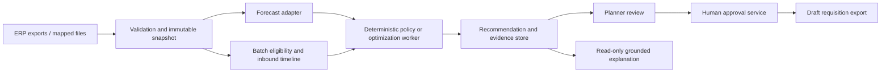

# NEXUS MVP specification and engineering roadmap

## Product decision

Build an inventory-to-procurement decision copilot for a regional pharmaceutical distributor with one warehouse and an initial 20–100 ambient SKUs. Primary user: inventory planner/buyer. Approver: procurement manager, with the distributor's quality function owning product eligibility and handling policies. Start with daily exported data; integrate with an existing ERP after the decision workflow is validated.

The first useful question is: **Which eligible products need replenishment, how much should we buy, from which approved supplier, and what tradeoffs or shortages remain?** A recommendation must be reproducible from a dated snapshot. It must show batch eligibility, demand basis, inbound timing, supplier constraints, cost and an approval record.

Assumptions made for this build: Indonesian operating context; IDR; a single warehouse-local calendar; ambient products only; no patient information; all UOM converted into the SKU's purchasing base unit upstream. These are design assumptions, not conclusions about the user's actual distributor or compliance status.

## Initial user workflow

1. **Import and reconcile.** Planner uploads demand, product master, batch stock, supplier offers and open PO lines. Validate completeness, dates, IDs, quantities, UOM and references. Show missing/censored data rather than treating it as zero. In the current slice these are bundled into one strict JSON snapshot; CSV mapping is a pilot milestone.
2. **Review exceptions.** Exclude reserved, quarantined, recalled and shelf-life-ineligible stock. Flag overdue inbound for an ETA correction. Block unsupported cold-chain products and stockout-censored history. Data owners fix the source and import again.
3. **Generate a proposal.** Calculate forecast and a daily inventory projection; compare approved supplier options and minimum order/pack quantities under available funds and capacity. Show “no feasible option” explicitly.
4. **Inspect evidence.** Show no-order baseline, quantity/cost/arrival per alternative, projected unmet demand, and why an option was excluded. The current UI ranks one supplier per SKU and uses priority-first budget allocation. It does not split orders or optimize the portfolio globally.
5. **Decide.** Approver records an approval or rejection with a reason. Changes to quantity, supplier, policy or inputs require a new run and approval. The current slice supports whole-plan approval for recommended lines, with blocked lines left unresolved; line-level overrides are planned.
6. **Export a draft requisition.** A backend gate requires a current, approved plan. The draft includes source hash, engine version, costs, approver and unresolved items. Export does not create a legally committed PO, send supplier messages, or change ERP stock.
7. **Close the loop in the pilot.** Reconcile actual PO acceptance, receipts and sales. Track override reasons, forecast error, supply performance and observed availability. Feed validated outcomes into future planning.

## Architecture

**Built now:** Python standard library HTTP server, plain HTML/CSS/JavaScript, pure decision engine, SQLite run/event/export ledger, synthetic fixture, strict input validation, API and tests. Loopback only. One process and one workspace. The server, not the browser, computes and validates decisions. No external AI credentials are required.

**Pilot target:** authenticated FastAPI service; Postgres with migrations, row/tenant authorization and transactional state transitions; object storage for immutable imports; a background analytical worker; OIDC roles for planner/approver/admin; append-only audit storage with restricted write credentials; structured telemetry and backups. Keep one deployable modular service initially. Add an outbox and idempotent ERP adapter only after the sandbox integration is verified. The browser never supplies authoritative prices, quantities, approval roles or solver results.

**LLM boundary:** optional tool-driven explanations and read-only contract lookup. The language model may explain signed/versioned tool outputs and quote authorized evidence. It may not produce the authoritative forecast, silently change a constraint, choose approval identity, execute SQL, dispatch procurement or approve its own recommendation. Every explanation must link to run/line/offer/forecast evidence. Prompt injection in retrieved documents must remain inert data. No multi-agent debate is needed for the first workflow.

## Forecasting and optimization boundaries

### Implemented baseline

- Forecast = trailing mean of 28 complete daily demand observations per SKU; no training beyond `as_of`. Missing days reject the snapshot. Stockout flags block that SKU because sales may censor true demand. Zero demand results in no replenishment.
- Daily FEFO (first expiry, first out) projection handles available unreserved batches, confirmed inbound and hypothetical supplier receipts. Ineligibility begins at `expiry - minimum_remaining_days`, exclusively. Historical demand is assumed representative of future **unreserved** demand; reserved commitments are already removed from inventory and must not be forecast again.
- Common comparison horizon = maximum quoted supplier lead time for that SKU + review interval. For each option, quantity covers projected demand after arrival through that common horizon plus a fixed safety-days buffer; unrecoverable lost demand before arrival is not ordered again. MOQ and pack-size rounding apply. All offers are evaluated on that same horizon, with no second replenishment assumed.
- Block unapproved/expired offers, insufficient shelf life, supplier capacity, conservative per-SKU stock cap and budget excess. The storage check counts current physical stock + all confirmed inbound + proposed quantity without crediting depletion, so it can reject feasible plans conservatively. It is not a warehouse cubic-volume model.
- Choose among feasible options by lowest projected unmet demand, then purchase cost, lead time and stable offer ID. Allocate shared budget in ascending product priority, then SKU. This is a transparent heuristic; it can leave money unused, block full orders instead of issuing partial orders, and miss a better joint allocation.
- “Unmet units” are deterministic lost sales in an illustrative projection. No claim of calibrated probability, target fill rate, medical criticality, causal savings or global optimality is made.

### Forecast adapter next

Compare moving mean, seasonal naive and intermittent-demand methods using `inventory-brain`'s walk-forward design, adapted to the actual calendar and SKU/location schema. All feature construction, clustering and model selection must stay inside each fold. Require training cutoff, model version, forecast horizon, point forecast, optional calibrated quantiles and cohort-level evaluation. Use at least enough clean history to span multiple holdouts; seasonal claims require seasonal history. Stockout correction and missing data need explicit approved rules. Do not label arbitrary high/low scenarios as confidence intervals.

Measure WAPE where aggregate actuals are nonzero, MAE/MASE where defined, signed bias and quantile pinball loss/coverage. Report undefined metrics and sparse cohorts. Forecast accuracy alone is insufficient: replay the inventory policy on held-out history with lead-time uncertainty, expiry and budget constraints. Choose a more complex model only if it improves decision outcomes without worsening availability for the pilot's priority items.

### Optimization adapter later

Use integer pack decisions `x[sku,supplier]`, supplier-activation binaries, dated receipt/inventory/lost-demand/waste states and explicit approved eligibility. Hard constraints: budget (including agreed freight/tax conventions), supplier capacity, pack/MOQ, batch life, approved source, storage capacity and lead times. Shared priorities must be agreed by the distributor, not inferred by an LLM. Minimize validated landed procurement + carrying + expiry + shortage costs, or use a clearly documented lexicographic service/cost objective if penalties are not credible.

Require feasibility validation independent of solver output, solver/version/time limit/status, objective bound/gap when meaningful, and a distinct infeasible/timeout result. Do not return `OPTIMAL` for heuristic or partial results. Cold-chain, interwarehouse transfers, substitutions, maritime routing, multi-echelon stock, uncertain lead times and recourse are later capabilities. The cold-chain planner and simulation agent become candidates only after their assumptions match the target operation.

## Approval and execution controls

Current state machine: `PENDING → APPROVED` or `PENDING → REJECTED`; approval is immutable. Each new run supersedes the prior run for the single workspace. Approval and export require today's snapshot, matching reviewed hash, matching recalculated engine result, and at least one recommended purchase line. SQLite transactions serialize concurrent decisions. Repeated export of the same active run returns the same artifact; identical-snapshot exports from different runs are blocked. The ledger records reviewer, reason, timestamp and source hash.

Current limitations: names are self-declared; local files are editable by the local user; no tamper-proof audit or separation of duties; freshness is calendar-day based, not a timestamp SLA; no automatic budget reservation across changed snapshots or outstanding requisitions. A changed snapshot can result in an additional draft; a pilot must reconcile drafts/POs and reserve budget by decision cycle before new approvals. Previously downloaded drafts cannot be revoked automatically.

Pilot gate: authenticated authorization on every API, approver spending limits, organization-approved separation of duties, signed immutable plan revisions, explicit warehouse timezone and staleness SLA, batch/PO revalidation at approval and dispatch, consolidated commitments and budget reservation. ERP dispatch requires an outbox, idempotency keys, retries, acceptance reconciliation and manual recovery. Procurement/quality staff define applicable operating rules; this prototype does not establish pharmaceutical regulatory compliance.

## Tests and acceptance gates

The implemented suite covers contract errors, future/missing/duplicate demand, nonfinite and boolean quantities, expiry boundary/FEFO, reservations and quarantine, late and unconfirmed inbound, MOQ/pack rounding, shared budget, storage/supplier/shelf-life constraints, unsupported cold products, known sample arithmetic, deterministic output, approval bypass, stale/superseded plans, rejection, concurrent decisions, duplicate export and persistence across reopening. HTTP integration tests exercise the complete workflow and session-token gate. See `VALIDATION.md` for actual execution results.

Before a live pilot add: independent inventory reconciliation; unit-conversion tests; temporal forecast leakage tests; hand-calculated multi-SKU optimization cases; infeasible/timeout solver tests; PO-state transitions; rejected and replayed authorizations; multi-tenant isolation; expiry-sensitive simulated backtests; injected/contradictory RAG evidence; accessible browser journey tests; load, backup/restore and failure recovery tests.

Pilot acceptance criteria proposed for agreement: all approved lines satisfy hard constraints; zero unauthorized or duplicate ERP submissions in the sandbox; all quantities reproducible from source IDs; import rejects unmapped UOM and unmatched SKUs; no worsening of observed priority-SKU availability versus current policy during shadow planning; planner review time and override reasons measured. Business savings targets are set only after establishing a baseline.

## Implementation roadmap

| Stage | Concrete deliverable | Exit gate | Focused engineering task |
|---|---|---|---|
| 0 — completed here | Audit, domain spec, working local vertical slice, synthetic fixture and automated tests | Reproducible plan → human decision → draft export | Separate original code; no upstream merges |
| 1 — data fit, roughly 1–2 weeks | One distributor's anonymized exports, CSV mappings, UOM master, batch/PO reconciliation, role/process interviews | A planner can reconcile every stock and inbound figure against the source | Add import adapter and data-quality report, with fixtures from agreed schemas |
| 2 — analytical validation, roughly 1–2 weeks | Adapter for selected `inventory-brain` forecasting/policy components; baseline comparison on held-out data | No temporal leakage; measured decision benefit and no unacceptable service degradation | One reviewed component per change; pinned upstream SHA, tests and notices |
| 3 — controlled pilot, roughly 2–3 weeks | Authenticated service, durable approvals, line overrides, budget reservations, shadow planning and monitoring | Authorization/replay/restore gates pass; buyer and quality owners sign off | Migrate ledger and APIs without changing decision semantics; then implement overrides |
| 4 — ERP draft integration, roughly 1–2 weeks | One sandbox connector, outbox, idempotency and reconciliation | Duplicate/retry/partial-failure scenarios pass; no unattended release | Connector tested against a stub and the named ERP sandbox |
| 5 — decision expansion | Joint procurement optimization, uncertainty, cold chain or transfers only where validated | Solver feasibility and scenario tests plus operational evidence | Evaluate one new decision class at a time; avoid broad agent orchestration |

Durations are planning estimates for a focused engineer with available data and a responsive domain owner, not delivery commitments. This task used Codex directly for implementation and testing; no extra user-owned task or external branch was created.

## Information needed for the next increment

An anonymized sample of daily demand, batch stock, supplier offers and open PO lines; the actual ERP/export format; SKU purchasing/selling unit conversions; treatment of reservations/backorders/returns; required customer shelf life; approver roles and spending limits; and one measured planning baseline. The next useful deliverable is an import adapter validated against those exports.
